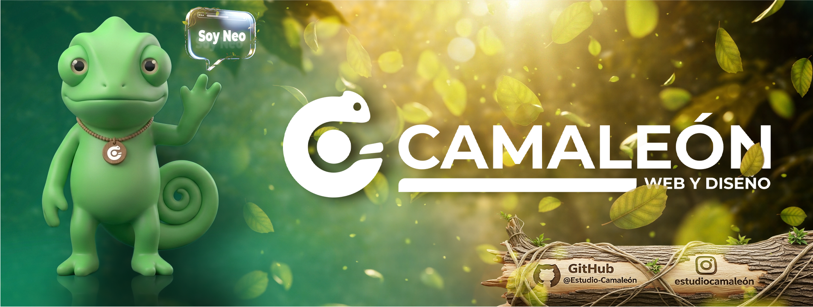

# 🦎 Camaleón Dev

  

---

## 🌐 Sobre nosotros
Camaleón es un estudio de diseño y desarrollo enfocado en la creación de productos digitales modernos, funcionales y escalables.

Trabajamos en la intersección entre diseño y tecnología, combinando estética, experiencia de usuario y desarrollo para construir soluciones digitales sólidas y eficientes.

Nuestro objetivo es transformar ideas en productos reales, entendiendo que cada proyecto tiene su propio contexto, necesidades y desafíos.

---

## 🧠 Nuestra filosofía
Creemos en la adaptabilidad como base del desarrollo.

Así como un camaleón se adapta a su entorno, nosotros ajustamos nuestro enfoque a cada proyecto, entendiendo que no existen soluciones genéricas.

Cada producto que desarrollamos está pensado para:

- Resolver problemas reales  
- Escalar en el tiempo  
- Mantener una identidad clara  
- Ofrecer una experiencia fluida  

---

## 💻 Qué hacemos

### 🌐 Desarrollo Web
Creamos sitios modernos, rápidos y optimizados para todo tipo de dispositivos.

### ⚙️ Aplicaciones a medida
Desarrollamos sistemas y plataformas adaptadas a las necesidades específicas de cada cliente.

### 🎨 Diseño UX/UI
Diseñamos interfaces intuitivas, atractivas y centradas en el usuario.

### 🧩 Branding Digital
Construimos identidades digitales coherentes, pensadas para destacar en entornos digitales.

---

## ⚙️ Cómo trabajamos
Nuestro proceso está basado en una estructura clara:

### 🧠 Análisis
Entendemos el proyecto, sus objetivos y su público.

### 🎨 Diseño
Creamos la estructura visual y la experiencia del producto.

### 💻 Desarrollo
Transformamos el diseño en un producto funcional y escalable.

### 🚀 Lanzamiento
Publicamos y optimizamos el producto para su uso real.

---

## 🚀 Nuestro enfoque
Trabajamos con una mentalidad enfocada en la calidad y el crecimiento a largo plazo.

- Código limpio y mantenible  
- Diseño con intención  
- Enfoque en experiencia de usuario  
- Soluciones escalables  
- Adaptación constante  

---

## 👨‍💻 Equipo

- 💻 **LynxWiLd** — Desarrollo  
- 💻 **Niconeta** *(he/him)* — Desarrollo  
- 🎨 **Maxi1197** — Diseño Gráfico  

---

## 🧪 Tecnologías
Trabajamos con tecnologías modernas del ecosistema web:

- Frontend: HTML, CSS, JavaScript  
- Frameworks modernos  
- Backend y APIs  
- Bases de datos  
- Herramientas de diseño y prototipado  

---

## 📌 Objetivo
Nuestro objetivo es ayudar a marcas, emprendedores y empresas a construir productos digitales que no solo funcionen bien, sino que también generen impacto.

---

## 🧠 Filosofía final
> "Nos adaptamos a tu idea y la convertimos en software." 🦎

---

## 📫 Contacto
Estamos abiertos a nuevos proyectos, colaboraciones y desafíos.
